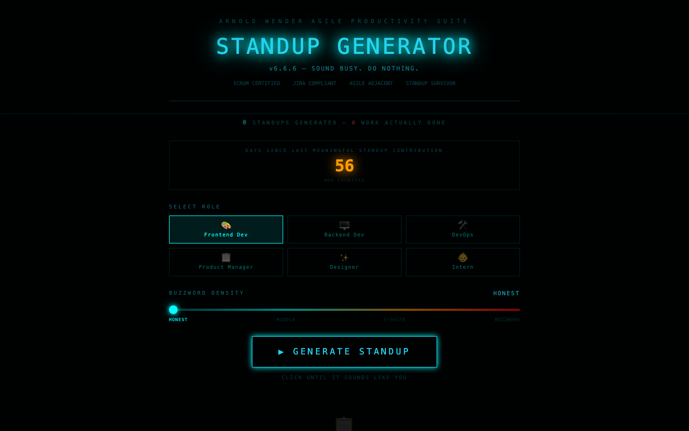

# :briefcase: Standup Generator

**Generate fake standup meeting updates that sound convincingly productive.**

Built by [Arnold Wender](https://github.com/arnoldwender)

[:rocket: Live Demo](https://standup-generator.netlify.app)



## Features

- Buzzword density slider — from "almost believable" to "full corporate meltdown"
- 6 developer roles with tailored jargon (Frontend, Backend, DevOps, PM, Designer, Intern)
- Standup bingo — mark off classic standup phrases as they appear
- Speedrun mode — generate an entire week of standups in seconds
- One-click copy-to-Slack formatting
- Calendar widget to schedule your fictional productivity
- 12 unlockable achievements for the most dedicated meeting survivors
- Shareable standup cards with screenshot export

## Tech Stack

- **React 18** + **TypeScript**
- **Vite** — lightning-fast dev server and builds
- **Tailwind CSS** — utility-first styling
- **Framer Motion** — smooth animations and transitions
- **canvas-confetti** — celebration effects
- **html2canvas** — standup card export
- **Lucide React** — icon set

## Getting Started

```bash
# Clone the repository
git clone https://github.com/arnoldwender/standup-generator.git
cd standup-generator

# Install dependencies
npm install

# Start development server
npm run dev
```

Open [http://localhost:5173](http://localhost:5173) in your browser.

## Build

```bash
npm run build
npm run preview
```

## License

MIT
